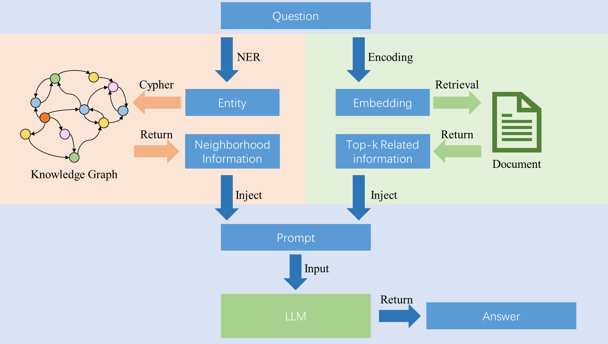
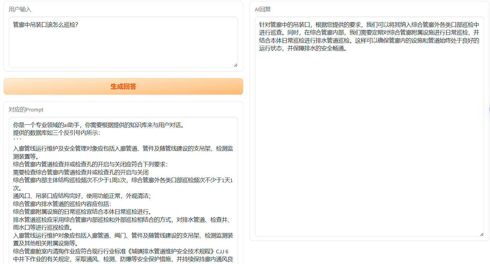
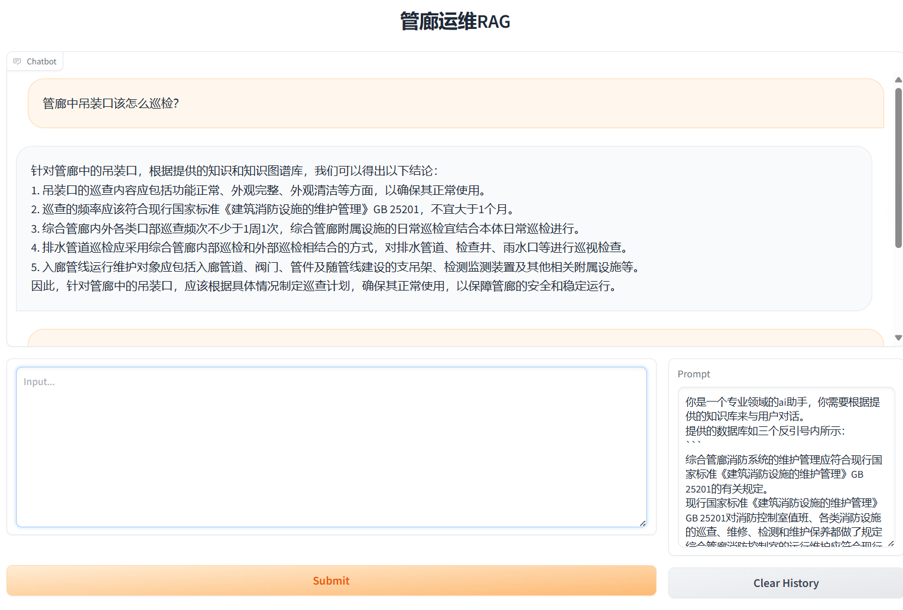

# KG-RAG

简单实现了一下基于知识图谱和文本文档联合做检索增强(RAG)大模型的实现

这里采用的数据分别是**管廊维护领域**的文本文档和专家知识图谱

## 算法设计



## 项目目录

```bash
.
├── README.md
├── img
├── data/
    ├── pipe/                                      (管廊标准的原始文件，这里不公开了)
    ├── config.ini                                 (密钥等配置文件)
    ├── kg_entity.pt                               (知识图谱向量文件)
    ├── somuut_x.pt                                (管廊运维的向量文件)
    └── somuut.txt                                 (管廊运维的文本文件)
├── utils/
    ├── sim.ipynb                                  (向量相似度计算的示例)
    └── docx2txt.py                                (docx文件转txt预处理方法)
├── THUDM/chatglm2-6b-int4                         (glm2-6b的模型文件，请前往chatglm官方下载)
├── requiements.txt                                (环境配置)
├── llm_api.py                                     (调用大语言模型接口的方法)
├── rag_bot.py                                     (检索增强类和相关函数)
├── web_demo1.py                                   (单轮对话网页demo)
└── web_demo2.py                                   (多轮对话网页demo)
```

## 实现效果

### 单轮对话：



### 多轮对话：

## 环境配置 

**图数据库启动**

```shell
neo4j console
```

一些特殊依赖库的安装方法推荐：

**faiss-gpu 安装**

```shell
conda install -c conda-forge faiss-gpu
```

**torch-gpu 安装**

```shell
pip install torch==1.13.1+cu116 --extra-index-url https://download.pytorch.org/whl/cu116
```

其他依赖库直接用pip install 安装即可

```bash
pip install -r requirements.txt
```

**端口占用解决方案**

查询对应的端口是否存在任务：

```shell
netstat -ano | findstr :9006
```

找到PID号之后杀死任务：

```shell
taskkill /F /PID 1234
```

## 相关项目

> 阿里通义千问开源模型[QWEN1.5](https://github.com/QwenLM/Qwen1.5)（调用阿里云提供的api）
>
> [chatglm2-6b-int](https://github.com/THUDM/ChatGLM2-6B)（量化版比较方便本地部署）
